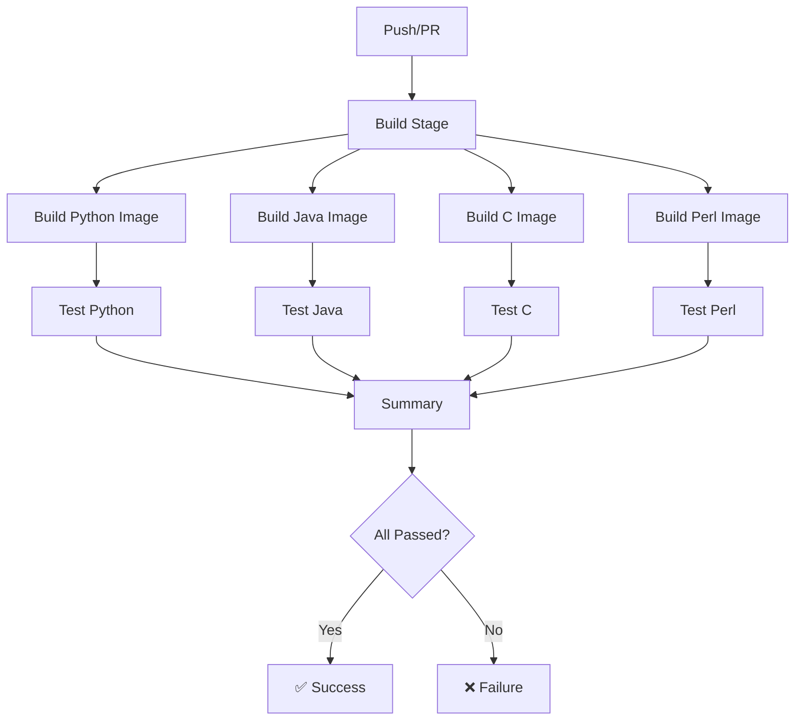

# Integration Tests - Multi-Language Containerized

This directory contains integration tests for business applications written in multiple languages (Python, Java, C, Perl), each running in isolated containerized environments.

## 📁 Directory Structure

```
components/tests/integration/
├── python/
│   ├── Dockerfile                    # Python test environment
│   └── test_python_integration.py    # Python integration tests
├── java/
│   ├── Dockerfile                    # Java test environment
│   ├── pom.xml                       # Maven dependencies
│   └── test_java_integration.sh      # Java test runner
├── c/
│   ├── Dockerfile                    # C test environment
│   ├── CMakeLists.txt                # CMake build configuration
│   └── test_c_integration.sh         # C test runner
├── perl/
│   ├── Dockerfile                    # Perl test environment
│   └── test_perl_integration.pl      # Perl integration tests
├── docker-compose.integration-tests.yml
└── README.md                         # This file
```

## 🎯 Test Strategy

Each language has:
1. **Isolated Container** - Pre-built environment with all dependencies
2. **Language-Specific Tests** - Tests appropriate for each language's ecosystem
3. **Common Test Scenarios** - Multiprocess/multithread execution, file processing, monitoring integration

## 🚀 Running Tests

### Local Development

#### Run All Tests with Docker Compose
```bash
cd components/tests
docker compose -f docker-compose.integration-tests.yml up --build
```

#### Run Individual Language Tests
```bash
# Python
docker compose -f docker-compose.integration-tests.yml up test-python

# Java
docker compose -f docker-compose.integration-tests.yml up test-java

# C
docker compose -f docker-compose.integration-tests.yml up test-c

# Perl
docker compose -f docker-compose.integration-tests.yml up test-perl
```

#### Run Tests Directly with Docker
```bash
# Python
docker build -t wafer-test-python -f integration/python/Dockerfile ../..
docker run --rm wafer-test-python

# Java
docker build -t wafer-test-java -f integration/java/Dockerfile ../..
docker run --rm wafer-test-java

# C
docker build -t wafer-test-c -f integration/c/Dockerfile ../..
docker run --rm --cap-add=SYS_PTRACE wafer-test-c

# Perl
docker build -t wafer-test-perl -f integration/perl/Dockerfile ../..
docker run --rm wafer-test-perl
```

### CI/CD Pipeline

Tests run automatically in GitHub Actions with:
1. **Pre-build Stage** - All 4 containers built in parallel
2. **Test Stage** - Tests run concurrently in isolated containers
3. **Artifact Upload** - Test results and coverage reports saved

See `.github/workflows/integration-tests.yml` for details.

## 🐍 Python Tests

**Environment**: Python 3.11-slim

**Dependencies**:
- `pytest` - Test framework
- `pytest-asyncio` - Async test support
- `pytest-cov` - Code coverage
- `httpx` - HTTP client
- `pydantic` - Data validation
- `psutil` - System metrics

**Test Coverage**:
- ✅ Module imports
- ✅ File processing (1MB files)
- ✅ Multiprocess execution
- ✅ Monitoring SDK integration
- ✅ Performance metrics collection
- ✅ Error handling

**Run Locally**:
```bash
pytest components/tests/integration/python/test_python_integration.py -v
```

## ☕ Java Tests

**Environment**: Eclipse Temurin JDK 17

**Dependencies**:
- Maven - Build tool
- JUnit 5 - Test framework
- Apache HttpClient 5 - HTTP client
- Gson - JSON processing

**Test Coverage**:
- ✅ Compilation check
- ✅ Basic execution
- ✅ Monitoring integration
- ✅ Thread safety
- ✅ Memory handling

**Run Locally**:
```bash
bash components/tests/integration/java/test_java_integration.sh
```

## 🔧 C Tests

**Environment**: GCC 13

**Dependencies**:
- CMake - Build system
- libcurl - HTTP client
- libjson-c - JSON processing
- Valgrind - Memory profiling
- GDB - Debugger

**Test Coverage**:
- ✅ Compilation check
- ✅ Binary validation
- ✅ Basic execution
- ✅ Memory leak detection (Valgrind)
- ✅ Process forking
- ✅ Signal handling
- ✅ HTTP monitoring integration

**Run Locally**:
```bash
bash components/tests/integration/c/test_c_integration.sh
```

## 🐪 Perl Tests

**Environment**: Perl 5.38

**Dependencies**:
- LWP::UserAgent - HTTP client
- JSON - JSON processing
- Parallel::ForkManager - Process management
- Test::More - Test framework
- Test::Deep - Deep comparison

**Test Coverage**:
- ✅ Module loading
- ✅ Script validation
- ✅ File processing
- ✅ JSON handling
- ✅ HTTP client
- ✅ Fork manager
- ✅ Script execution
- ✅ Monitoring integration

**Run Locally**:
```bash
perl components/tests/integration/perl/test_perl_integration.pl
```

## 📊 Test Results

Test results are available in multiple formats:

### Python
- Console output with pytest
- HTML coverage report: `coverage/python/index.html`
- JUnit XML: `test-results/python-junit.xml`

### Java
- Shell script output
- Test logs: `test-results/java-*.log`

### C
- Shell script output
- Valgrind report: `test-results/valgrind-*.txt`

### Perl
- TAP (Test Anything Protocol) output
- Test summary: `test-results/perl-*.tap`

## 🔍 Debugging Failed Tests

### Python
```bash
# Run with verbose output
docker run --rm -it wafer-test-python pytest -vv --tb=long

# Run specific test
docker run --rm -it wafer-test-python pytest -k "test_name" -vv
```

### Java
```bash
# Run with debug output
docker run --rm -it wafer-test-java bash
# Inside container:
java -verbose java_multithread_job 1 1
```

### C
```bash
# Run with GDB
docker run --rm -it --cap-add=SYS_PTRACE wafer-test-c bash
# Inside container:
gdb ./c_multiprocess_job
```

### Perl
```bash
# Run with verbose output
docker run --rm -it wafer-test-perl perl -d /workspace/tests/test_perl_integration.pl
```

## 🏗️ CI/CD Architecture



## 📦 Container Images

Pre-built test images are stored in GitHub Container Registry:

- `ghcr.io/<org>/wafer-monitor-test-python:latest`
- `ghcr.io/<org>/wafer-monitor-test-java:latest`
- `ghcr.io/<org>/wafer-monitor-test-c:latest`
- `ghcr.io/<org>/wafer-monitor-test-perl:latest`

## 🔧 Customization

### Adding New Language Tests

1. Create directory: `components/tests/integration/<language>/`
2. Add Dockerfile with test environment
3. Add language-specific tests
4. Update `docker-compose.integration-tests.yml`
5. Update `.github/workflows/integration-tests.yml`
6. Update this README

### Modifying Test Scenarios

Edit the test files directly:
- Python: `test_python_integration.py`
- Java: `test_java_integration.sh`
- C: `test_c_integration.sh`
- Perl: `test_perl_integration.pl`

### Adjusting Test Timeouts

In Docker Compose:
```yaml
services:
  test-<language>:
    deploy:
      resources:
        limits:
          cpus: '2'
          memory: 1G
```

## 📈 Performance Benchmarks

Expected execution times (local Docker):

| Language | Build Time | Test Time | Total |
|----------|------------|-----------|-------|
| Python   | ~30s       | ~15s      | ~45s  |
| Java     | ~60s       | ~20s      | ~80s  |
| C        | ~20s       | ~25s      | ~45s  |
| Perl     | ~45s       | ~15s      | ~60s  |

**Total parallel execution**: ~90s (vs ~230s sequential)

## 🐛 Troubleshooting

### Container Build Failures
```bash
# Clear Docker cache
docker system prune -af

# Rebuild without cache
docker build --no-cache -t wafer-test-<language> -f integration/<language>/Dockerfile ../..
```

### Test Execution Failures
```bash
# Check logs
docker logs wafer-test-<language>

# Run interactively
docker run --rm -it wafer-test-<language> /bin/bash
```

### Permission Errors
```bash
# Ensure scripts are executable
chmod +x components/tests/integration/*/test_*.sh
chmod +x components/tests/integration/*/test_*.pl
```

## 📚 References

- [Python Testing Best Practices](https://docs.pytest.org/en/stable/goodpractices.html)
- [JUnit 5 Documentation](https://junit.org/junit5/docs/current/user-guide/)
- [Valgrind Quick Start](https://valgrind.org/docs/manual/quick-start.html)
- [Perl Testing Tutorial](https://perldoc.perl.org/Test::Tutorial)

## 🤝 Contributing

When adding or modifying tests:

1. Ensure all tests pass locally
2. Update documentation
3. Add test coverage metrics
4. Follow language-specific conventions
5. Keep containers minimal and focused

---

**Last Updated**: 2025-10-20  
**Maintainer**: DevOps Team  
**CI/CD Status**: [](../../.github/workflows/integration-tests.yml)

